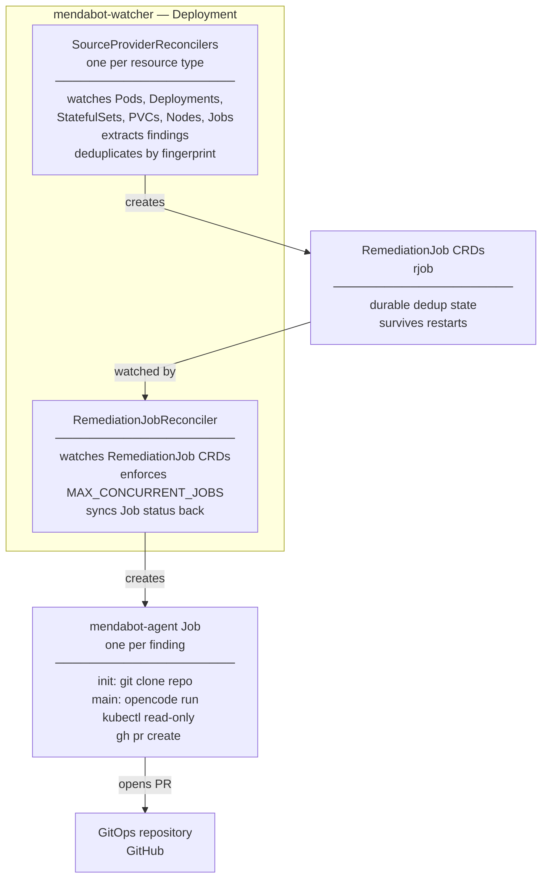
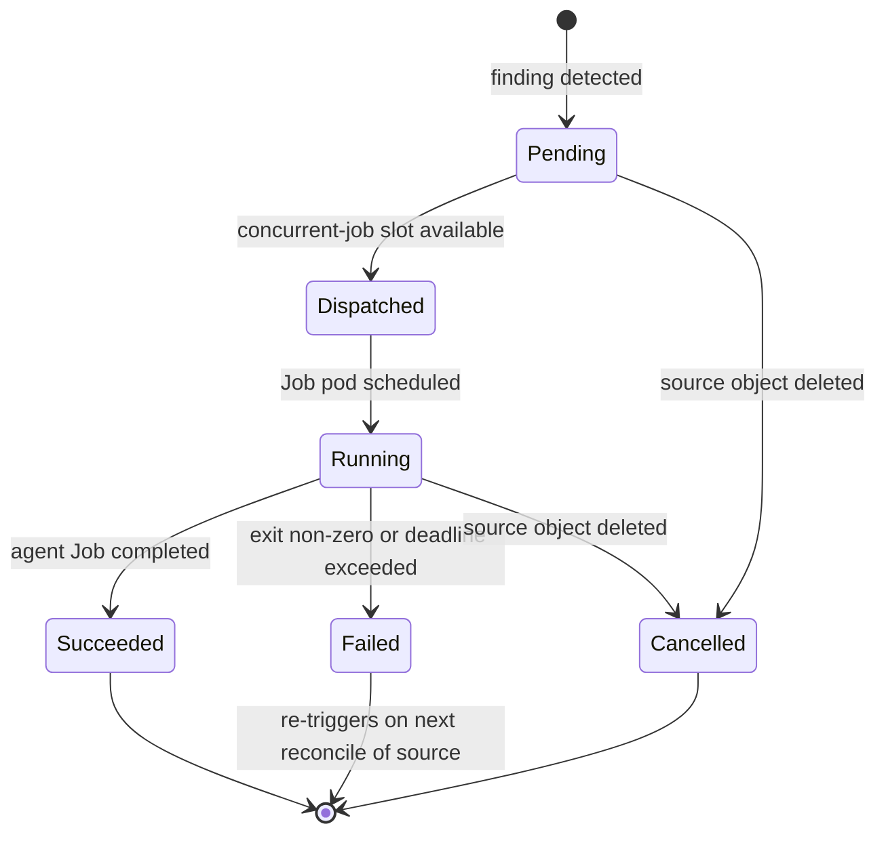

# k8s-mendabot

k8s-mendabot is a Kubernetes controller that watches your cluster for failures,
investigates them automatically, and opens pull requests on your GitOps repository
with proposed fixes — all without leaving your cluster.

When a Pod is crash-looping, a Deployment is degraded, or a Node goes NotReady,
mendabot spawns an in-cluster [OpenCode](https://opencode.ai) agent that inspects
the live cluster, locates the relevant manifests in your GitOps repo, determines the
root cause, and opens a PR. You review and merge. No external operators, no
external databases, no persistent services outside your cluster.

## What it does

1. **Detects failures** — watches Pods, Deployments, StatefulSets, PVCs, Nodes, and
   Jobs natively via the Kubernetes API
2. **Deduplicates by parent** — repeated pod restarts from the same Deployment produce
   one investigation, not one per pod restart
3. **Stabilises before acting** — a configurable window (default: 120s) filters
   transient blips before dispatching
4. **Investigates in-cluster** — an agent Job runs with read-only RBAC, clones your
   GitOps repo, and inspects the live cluster
5. **Opens a PR** — with a structured body: summary, evidence, root cause, proposed
   fix, and confidence level

**Three possible outcomes per invocation:**

| Outcome | When | Action |
|---|---|---|
| Fix PR | Root cause identified, confidence medium or high | Opens a PR with a targeted manifest change |
| Investigation PR | Root cause unclear or confidence low | Opens a PR with an investigation report, labelled `needs-human-review` |
| Comment | An open PR already exists for this fingerprint | Comments with updated findings; no new PR |

Hard constraints enforced in the agent prompt: never commit directly to `main`; never
touch Kubernetes Secrets in the GitOps repo; exactly one outcome per invocation.

## Features

**OpenCode agentic workflow** — investigations are driven by [OpenCode](https://opencode.ai)
running inside your cluster. Works with any OpenAI-compatible LLM endpoint. Additional
agent backends are planned.

**Detection** — watches Pods, Deployments, StatefulSets, PVCs, Nodes, and Jobs natively.
Covers `CrashLoopBackOff`, `ImagePullBackOff`, `OOMKilled`, degraded Deployments,
unschedulable pods, failed Jobs, PVC provisioning failures, and unhealthy Nodes.

**Deduplication** — findings are deduplicated by parent resource fingerprint
(`sha256(namespace + kind + parentObject + sorted errors)`). Repeated pod restarts from
the same Deployment produce one investigation. State is stored in `RemediationJob` CRD
objects — survives watcher restarts, no external store required.

**Stabilisation window** — a configurable hold period (default: 120s) suppresses
transient blips before an investigation is dispatched.

**Concurrency throttling** — `maxConcurrentJobs` (default: 3) caps simultaneous agent
Jobs. Excess findings queue as `Pending` and dispatch as slots become available.

**Customisable agent prompt** — the investigation prompt is mounted from a ConfigMap and
can be fully overridden via `prompt.coreOverride` / `prompt.agentOverride` in
`values.yaml`.

**Prometheus metrics** — optional metrics Service and Prometheus Operator
`ServiceMonitor` for watcher health observability.

### Security

**Secret redaction** — error text extracted from cluster state (pod `Waiting.Message`,
node condition messages, etc.) is passed through a redaction filter before being stored
in `RemediationJob` or injected into the agent. Patterns include URL credentials,
base64-encoded values ≥ 40 chars, and common secret key prefixes (`password=`,
`token=`, `api-key=`, etc.).

**Prompt injection detection** — `Finding.Errors` is bounded to 500 characters per
field and wrapped in an explicit untrusted-data envelope in the prompt. Injection
heuristics (`ignore.*previous.*instructions`) are detected and logged; configurable to
suppress the finding entirely (`INJECTION_DETECTION_ACTION=suppress`).

**Agent network policy** — an opt-in `NetworkPolicy` restricts agent Job egress to the
cluster API server, GitHub, and the LLM endpoint. Available as a Kustomize overlay
(`deploy/overlays/security/`).

**Read-only agent RBAC** — the agent holds only `get/list/watch` verbs cluster-wide.
It cannot create, modify, or delete any Kubernetes resource. All cluster changes go
through Git and your GitOps reconciler.

**Namespace-scoped agent RBAC** — `AGENT_RBAC_SCOPE=namespace` switches the agent from
a cluster-wide `ClusterRole` to a namespace-scoped `Role`, limiting what the agent can
read to the namespaces you specify.

**Structured audit log** — all suppression and dispatch decisions emit structured log
lines with `audit: true`, queryable from any log aggregation system (Loki,
Elasticsearch, Datadog) for post-incident forensics.

**Short-lived GitHub credentials** — the agent never holds a long-lived PAT. A GitHub
App installation token (1-hour TTL) is exchanged in the init container and never
exposed to the main agent container.

## Quick Start

### Prerequisites

- Kubernetes >= 1.28
- Helm >= 3.14
- A GitHub App installed on your GitOps repository with: Contents (write), Pull Requests (write), Issues (write)
- An OpenAI-compatible LLM API key

#### GitHub App permissions

| Permission | Level | Purpose |
|---|---|---|
| Contents | Write | Clone repository, create branches, push changes |
| Pull requests | Write | Create and comment on pull requests |
| Issues | Write | Reference issues in PR descriptions |

The `github-app` Secret must contain three keys:

```yaml
data:
  app-id: <GitHub App ID>
  installation-id: <Installation ID for your repository>
  private-key: <PEM-encoded RSA private key>
```

The private key is used only in the agent Job's init container to exchange a
short-lived installation token (1-hour TTL). It is never injected into the main
agent container.

### 1. Create required Secrets

```sh
kubectl create namespace mendabot

kubectl create secret generic github-app \
  --namespace mendabot \
  --from-literal=app-id=<your-app-id> \
  --from-literal=installation-id=<your-installation-id> \
  --from-file=private-key=<path-to-private-key.pem>

kubectl create secret generic llm-credentials-opencode \
  --namespace mendabot \
  --from-literal=provider-config='{"model":"gpt-4o","providers":{"openai":{"apiKey":"<your-api-key>","baseURL":"https://api.openai.com/v1"}}}'
```

### 2. Install with Helm

```sh
helm install mendabot charts/mendabot/ \
  --namespace mendabot \
  --set gitops.repo=myorg/my-gitops-repo \
  --set gitops.manifestRoot=kubernetes
```

### 3. Verify

```sh
kubectl get deployment -n mendabot
kubectl get rjob -n mendabot
```

## Configuration

### Helm values reference

All `values.yaml` keys and their defaults:

| Key | Default | Description |
|---|---|---|
| `image.repository` | `ghcr.io/lenaxia/mendabot-watcher` | Watcher image repository |
| `image.tag` | `""` (uses `Chart.appVersion`) | Watcher image tag |
| `image.pullPolicy` | `IfNotPresent` | Image pull policy |
| `agent.image.repository` | `ghcr.io/lenaxia/mendabot-agent` | Agent image repository |
| `agent.image.tag` | `""` (uses `Chart.appVersion`) | Agent image tag |
| `gitops.repo` | **required** | GitOps repository in `org/repo` format |
| `gitops.manifestRoot` | **required** | Path within repo to manifests root |
| `watcher.stabilisationWindowSeconds` | `120` | Seconds a finding must persist before dispatching |
| `watcher.maxConcurrentJobs` | `3` | Maximum simultaneous agent Jobs |
| `watcher.remediationJobTTLSeconds` | `604800` | TTL for completed RemediationJob objects (7 days) |
| `watcher.sinkType` | `github` | Sink type for PR creation |
| `watcher.logLevel` | `info` | Log level: debug, info, warn, error |
| `agentType` | `opencode` | Agent runner type. Currently `opencode`; additional agent backends planned. |
| `prompt.coreOverride` | `""` | Full core prompt override (replaces built-in `files/prompts/core.txt`) |
| `prompt.agentOverride` | `""` | Full agent prompt override (replaces built-in `files/prompts/<agentType>.txt`) |
| `rbac.create` | `true` | Create RBAC resources |
| `createNamespace` | `false` | Create `Release.Namespace` if it does not exist |
| `metrics.enabled` | `false` | Expose metrics Service on port 8080 |
| `metrics.serviceMonitor.enabled` | `false` | Create Prometheus Operator ServiceMonitor |
| `metrics.serviceMonitor.interval` | `30s` | Prometheus scrape interval |
| `metrics.serviceMonitor.scrapeTimeout` | `10s` | Prometheus scrape timeout |
| `metrics.serviceMonitor.labels` | `{}` | Additional labels for the ServiceMonitor |

### Configuration validation

The watcher validates configuration at startup with clear error messages.

**Numeric validations:**
- `MAX_CONCURRENT_JOBS`: must be > 0
- `REMEDIATION_JOB_TTL_SECONDS`: must be > 0
- `STABILISATION_WINDOW_SECONDS`: must be ≥ 0

**Format validations:**
- `GITOPS_REPO`: must be in `owner/repo` format

## How it works



### What the agent does

The agent runs [OpenCode](https://opencode.ai) inside the cluster with read-only RBAC
and follows a structured investigation:

1. Check for an existing open PR for this fingerprint — if found, comment on it and exit
2. `kubectl describe` and `kubectl get events` on the failing resource
3. Inspect related resources (owning Deployment, Endpoints, PVs, etc.)
4. Locate the relevant manifests in the cloned GitOps repository
5. Inspect Flux/Helm state with `flux get all` and `helm list`
6. Determine root cause and assign a confidence level (high / medium / low)
7. Validate proposed changes with `kubeconform` and `kustomize build`
8. Open a pull request with a structured body: summary, evidence, root cause, fix, confidence

### The `RemediationJob` CRD

Every unique finding is tracked by a `RemediationJob` object (`rjob`).

```bash
kubectl get rjob -n mendabot
```

```
NAME                          PHASE       KIND         PARENT                  JOB                                   AGE
mendabot-a3f9c2b14d8e         Succeeded   Pod          Deployment/my-app       mendabot-agent-a3f9c2b14d8e           8m
mendabot-7bc1d3e90f21         Dispatched  Deployment   Deployment/api-server   mendabot-agent-7bc1d3e90f21           2m
mendabot-f4e2a1c85b67         Failed      Node         Node/worker-03                                                1h
```

#### RemediationJob lifecycle



- **Pending** — finding detected, waiting for a concurrent-job slot
- **Dispatched** — `batch/v1 Job` created, waiting for pod scheduling
- **Running** — agent pod is executing
- **Succeeded** — agent Job completed; `status.prRef` holds the PR URL if one was opened
- **Failed** — agent Job failed (exit non-zero or deadline exceeded); re-triggers on next reconcile
- **Cancelled** — source object was deleted while the investigation was in progress

### Components

| Component | Description |
|---|---|
| `mendabot-watcher` | Go controller (controller-runtime) that watches Kubernetes resources, manages `RemediationJob` CRDs, and creates agent Jobs |
| `mendabot-agent` | Docker image containing opencode + kubectl + helm + flux + gh and supporting investigation tools |

### Agent image tools

| Tool | Version | Purpose |
|---|---|---|
| `opencode` | `1.2.10` | AI agent driver |
| `kubectl` | `1.32.3` | Cluster inspection (read-only) |
| `helm` | `3.17.2` | Chart metadata, template rendering |
| `flux` | `2.5.1` | Flux status, trace, diff |
| `kustomize` | `5.6.0` | Render and validate Kustomize overlays |
| `gh` | latest stable | PR creation, listing, commenting |
| `kubeconform` | `0.7.0` | Kubernetes manifest schema validation |
| `yq` | `4.45.1` | YAML processing |
| `jq` | apt | JSON processing |
| `stern` | `1.31.0` | Multi-pod log tailing |
| `sops` | `3.9.4` | Decrypt SOPS-encrypted secrets |
| `age` | `1.3.1` | Decrypt age-encrypted files |
| `talosctl` | `1.9.4` | Talos node inspection (requires `talosconfig` mount) |

All binaries are fetched from official releases with SHA256 checksum verification.
The agent runs as non-root (`uid=1000`).

## Roadmap

Features under active development or planned:

| Area | Feature | Status |
|---|---|---|
| Operability | Kubernetes Events on `RemediationJob` (`kubectl describe rjob` shows lifecycle) | In Progress |
| Operability | Dry-run mode — investigate without opening PRs | Planned |
| Reliability | Dead-letter queue for permanently-failed jobs | Planned |
| Reliability | GitHub App token expiry fast-fail guard | Planned |
| Accuracy | Namespace-scoped provider filtering | Planned |
| Accuracy | Per-resource opt-out annotations | Planned |
| Accuracy | Multi-signal correlation (related findings grouped into one investigation) | Planned |
| Accuracy | Mandatory pre-PR manifest validation | Planned |
| Impact | PR auto-close when finding resolves | Evaluated |
| Impact | GitLab and Gitea sink support | Evaluated |
| Signal sources | Prometheus / Alertmanager source provider | Evaluated |
| Signal sources | cert-manager certificate expiry provider | Evaluated |

See [`docs/BACKLOG/FEATURE_TRACKER.md`](docs/BACKLOG/FEATURE_TRACKER.md) for the
full product backlog with value/complexity ratings and implementation notes.

## Documentation

- [`docs/DESIGN/HLD.md`](docs/DESIGN/HLD.md) — Architecture and design decisions
- [`docs/DESIGN/lld/`](docs/DESIGN/lld/) — Component-level low-level designs
- [`docs/BACKLOG/`](docs/BACKLOG/) — Implementation backlog and feature tracker
- [`README-LLM.md`](README-LLM.md) — LLM implementation guide

## License

Apache 2.0
