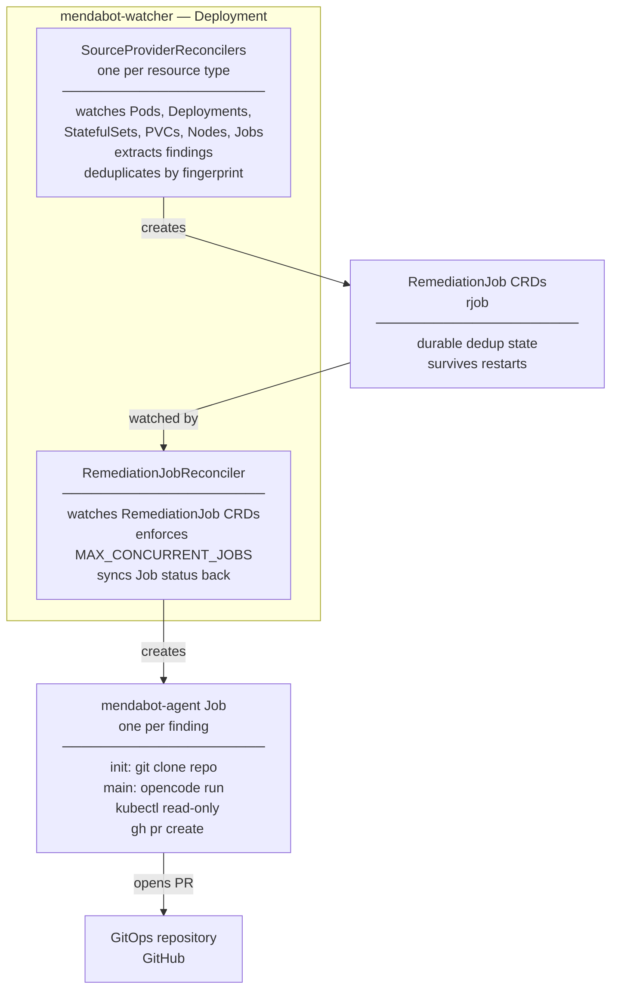
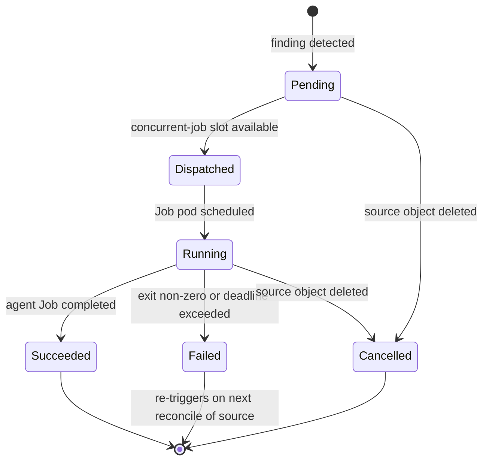

# k8s-mendabot

A Kubernetes controller that watches core cluster resources directly, deduplicates
findings by logical parent resource, and spawns an in-cluster
[OpenCode](https://opencode.ai) agent that investigates the problem and opens a pull
request on your GitOps repository with a proposed fix.

No external operators required.

## How it works



1. `mendabot-watcher` watches Pods, Deployments, StatefulSets, PVCs, Nodes, and Jobs
   natively via the Kubernetes API — no external operator required
2. A stabilisation window (default: 120s) filters transient failures before acting
3. Findings are deduplicated by parent resource fingerprint; the `RemediationJob` CRD
   is the sole state store — no external database, no in-memory maps
4. The `mendabot-agent` Job clones your GitOps repo, investigates the live cluster,
   and produces one of three outcomes (see [What the agent does](#what-the-agent-does))

## Detected failure conditions

| Resource | Detected conditions |
|---|---|
| Pod | `CrashLoopBackOff`, `ImagePullBackOff`, `OOMKilled`, `ErrImagePull`, unschedulable, non-zero exit code |
| Deployment | `spec.replicas != status.readyReplicas`, `Available=False` |
| StatefulSet | `spec.replicas != status.readyReplicas`, `Available=False` |
| PersistentVolumeClaim | `Phase == Pending` with `ProvisioningFailed` event |
| Node | `NodeReady == False/Unknown`, non-standard conditions |
| Job | Exhausted backoff limit (`failed > 0`, `active == 0`, `completionTime == nil`) |

## What the agent does

The agent runs [OpenCode](https://opencode.ai) inside the cluster with read-only RBAC.
It follows a structured investigation:

1. Check for an existing open PR for this fingerprint — if found, comment on it and exit
2. `kubectl describe` and `kubectl get events` on the failing resource
3. Inspect related resources (owning Deployment, Endpoints, PVs, etc.)
4. Locate the relevant manifests in the cloned GitOps repository
5. Inspect Flux/Helm state with `flux get all` and `helm list`
6. Determine root cause and assign a confidence level (high / medium / low)
7. Validate proposed changes with `kubeconform` and `kustomize build`
8. Open a pull request with a structured body: summary, evidence, root cause, fix, confidence

**Three possible outcomes per invocation:**

| Outcome | When | Action |
|---|---|---|
| Fix PR | Root cause identified, confidence medium or high | Opens a PR with a targeted manifest change |
| Comment | An open PR already exists for this fingerprint | Comments with updated findings; no new PR |
| Investigation PR | Root cause unclear or confidence low | Opens a PR with an investigation report only, labelled `needs-human-review` |

Hard constraints enforced in the prompt: never commit directly to `main`; never touch
Kubernetes Secrets in the GitOps repo; exactly one outcome per invocation.

## The `RemediationJob` CRD

Every unique finding is tracked by a `RemediationJob` object (`rjob`).
This is the sole deduplication state — it survives watcher restarts and requires no
external store.

```bash
kubectl get rjob -n mendabot
```

```
NAME                          PHASE       KIND         PARENT                  JOB                                   PR    AGE
mendabot-a3f9c2b14d8e         Succeeded   Pod          Deployment/my-app       mendabot-agent-a3f9c2b14d8e                 8m
mendabot-7bc1d3e90f21         Dispatched  Deployment   Deployment/api-server   mendabot-agent-7bc1d3e90f21                 2m
mendabot-f4e2a1c85b67         Failed      Node         Node/worker-03                                                      1h
```

### RemediationJob lifecycle



- **Pending** — finding detected, waiting for a concurrent-job slot
- **Dispatched** — `batch/v1 Job` created, waiting for pod scheduling
- **Running** — agent pod is executing
- **Succeeded** — agent Job completed; `status.prRef` holds the PR URL if one was opened
- **Failed** — agent Job failed (exit non-zero or deadline exceeded); re-triggers on next reconcile
- **Cancelled** — source object was deleted while the investigation was in progress

**Deduplication:** a new `RemediationJob` is only created when the fingerprint
`sha256(namespace + kind + parentObject + sorted(error texts))` is not already covered
by a non-Failed `RemediationJob`. If the error set changes materially (hash changes),
a new investigation is triggered. If the source clears while a Job is running, the
`RemediationJob` transitions to Cancelled.

## Components

| Component | Description |
|---|---|
| `mendabot-watcher` | Go controller (controller-runtime) that watches Kubernetes resources, manages `RemediationJob` CRDs, and creates agent Jobs |
| `mendabot-agent` | Docker image containing opencode + kubectl + helm + flux + gh and supporting investigation tools |

## Agent image tools

| Tool | Version | Purpose |
|---|---|---|
| `opencode` | `1.2.10` | AI agent driver |
| `kubectl` | `1.32.3` | Cluster inspection (read-only) |
| `helm` | `3.17.2` | Chart metadata, template rendering |
| `flux` | `2.5.1` | Flux status, trace, diff |
| `kustomize` | `5.6.0` | Render and validate Kustomize overlays |
| `gh` | latest stable | PR creation, listing, commenting |
| `kubeconform` | `0.7.0` | Kubernetes manifest schema validation |
| `yq` | `4.45.1` | YAML processing |
| `jq` | apt | JSON processing |
| `stern` | `1.31.0` | Multi-pod log tailing |
| `sops` | `3.9.4` | Decrypt SOPS-encrypted secrets |
| `age` | `1.3.1` | Decrypt age-encrypted files |
| `talosctl` | `1.9.4` | Talos node inspection (requires `talosconfig` mount) |

All binaries are fetched from official releases with SHA256 checksum verification.
The agent runs as non-root (`uid=1000`).

## Prerequisites

- A GitHub App installed on your GitOps repository
- An LLM API key supported by OpenCode (OpenAI-compatible endpoint)
- Kubernetes 1.28+

### GitHub App permissions

The GitHub App requires:

| Permission | Level |
|---|---|
| Contents | Write |
| Pull requests | Write |
| Issues | Write |

The `secret-github-app` Secret must contain three keys:

```yaml
data:
  app-id: <GitHub App ID>
  installation-id: <Installation ID for your org/repo>
  private-key: <PEM-encoded RSA private key>
```

The private key is used only in the agent Job's init container to exchange a short-lived
installation token (1-hour TTL). It is never injected into the main agent container.

## Deployment

```bash
# Clone this repo
git clone https://github.com/lenaxia/k8s-mendabot

# Fill in secret placeholders
cp deploy/kustomize/secret-github-app.yaml.example deploy/kustomize/secret-github-app.yaml
cp deploy/kustomize/secret-llm.yaml.example deploy/kustomize/secret-llm.yaml
# Edit both files with your real values

# Apply
kubectl apply -k deploy/kustomize/
```

## Configuration

All configuration is via environment variables on the watcher Deployment.
Required variables must be set or the watcher will fail to start.

### Required

| Variable | Description |
|---|---|
| `GITOPS_REPO` | GitHub repository in `owner/repo` format |
| `GITOPS_MANIFEST_ROOT` | Path within the cloned repo to the manifests root |
| `AGENT_IMAGE` | Full image reference for the agent container (e.g. `ghcr.io/lenaxia/mendabot-agent:latest`) |
| `AGENT_NAMESPACE` | Namespace where agent Jobs are created (must match the watcher's own namespace) |
| `AGENT_SA` | ServiceAccount name for agent Jobs |

### Optional

| Variable | Default | Description |
|---|---|---|
| `STABILISATION_WINDOW_SECONDS` | `120` | Seconds a finding must persist before a Job is dispatched; `0` disables the window |
| `MAX_CONCURRENT_JOBS` | `3` | Maximum simultaneously running agent Jobs |
| `REMEDIATION_JOB_TTL_SECONDS` | `604800` | Seconds after which a `Succeeded` RemediationJob is deleted (default: 7 days) |
| `SINK_TYPE` | `github` | Sink implementation for the agent to use |
| `LOG_LEVEL` | `info` | Log verbosity: `debug`, `info`, `warn`, `error` |

### Secrets

| Secret | Key | Description |
|---|---|---|
| `secret-github-app` | `app-id` | GitHub App ID |
| `secret-github-app` | `installation-id` | GitHub App installation ID |
| `secret-github-app` | `private-key` | PEM-encoded RSA private key |
| `secret-llm` | `api-key` | LLM API key |
| `secret-llm` | `base-url` | LLM API base URL (optional; for non-OpenAI endpoints) |
| `secret-llm` | `model` | LLM model name (optional) |

See [`docs/DESIGN/lld/DEPLOY_LLD.md`](docs/DESIGN/lld/DEPLOY_LLD.md) for the full
configuration reference.

## Documentation

- [`docs/DESIGN/HLD.md`](docs/DESIGN/HLD.md) — Architecture and design decisions
- [`docs/DESIGN/lld/`](docs/DESIGN/lld/) — Component-level low-level designs
- [`docs/BACKLOG/`](docs/BACKLOG/) — Implementation backlog and feature tracker
- [`README-LLM.md`](README-LLM.md) — LLM implementation guide

## License

Apache 2.0
