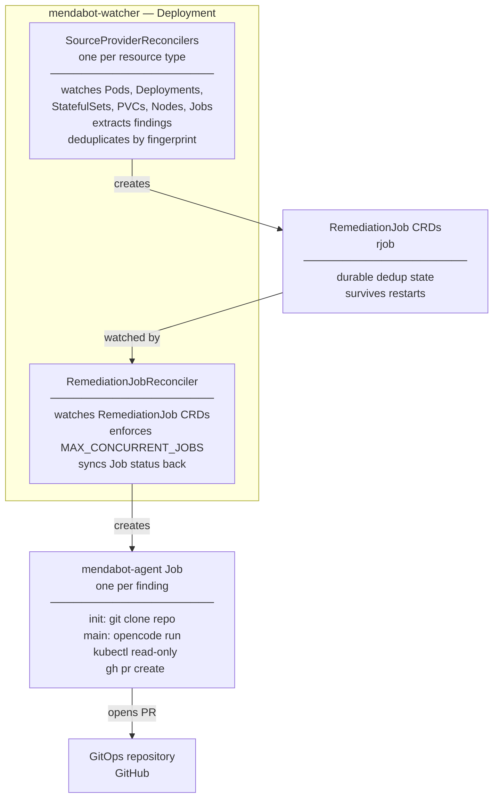
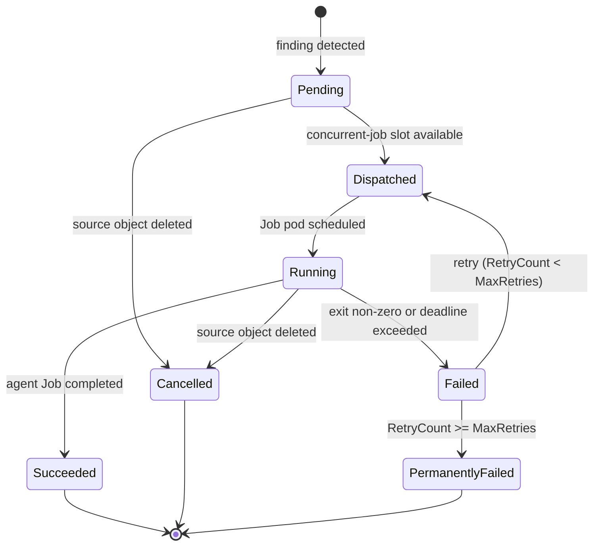

# k8s-mendabot

k8s-mendabot is a Kubernetes controller that watches your cluster for failures,
investigates them automatically, and opens pull requests on your GitOps repository
with proposed fixes — all without leaving your cluster.

When a Pod is crash-looping, a Deployment is degraded, or a Node goes NotReady,
mendabot spawns an in-cluster [OpenCode](https://opencode.ai) agent that inspects
the live cluster, locates the relevant manifests in your GitOps repo, determines the
root cause, and opens a PR. You review and merge. No external operators, no
external databases, no persistent services outside your cluster.

## What it does

1. **Detects failures** — watches Pods, Deployments, StatefulSets, PVCs, Nodes, and
   Jobs natively via the Kubernetes API
2. **Deduplicates by parent** — repeated pod restarts from the same Deployment produce
   one investigation, not one per pod restart
3. **Stabilises before acting** — a configurable window (default: 120s) filters
   transient blips before dispatching
4. **Investigates in-cluster** — an agent Job runs with read-only RBAC, clones your
   GitOps repo, and inspects the live cluster
5. **Opens a PR** — with a structured body: summary, evidence, root cause, proposed
   fix, and confidence level

**Three possible outcomes per invocation:**

| Outcome | When | Action |
|---|---|---|
| Fix PR | Root cause identified, confidence medium or high | Opens a PR with a targeted manifest change |
| Investigation PR | Root cause unclear or confidence low | Opens a PR with an investigation report, labelled `needs-human-review` |
| Comment | An open PR already exists for this fingerprint | Comments with updated findings; no new PR |

Hard constraints enforced in the agent prompt: never commit directly to `main`; never
touch Kubernetes Secrets in the GitOps repo; exactly one outcome per invocation.

## Features

**[OpenCode agentic workflow](docs/WORKLOGS/0071_2026-02-23_epic08-pluggable-agent-complete.md)** — investigations are driven by [OpenCode](https://opencode.ai)
running inside your cluster. Works with any OpenAI-compatible LLM endpoint. Additional agent backends are planned.

**[Detection](docs/WORKLOGS/0033_2026-02-22_epic09-native-provider-complete.md)** — watches Pods, Deployments, StatefulSets, PVCs, Nodes, and Jobs natively.
Covers `CrashLoopBackOff`, `ImagePullBackOff`, `OOMKilled`, degraded Deployments, unschedulable pods, failed Jobs, PVC provisioning failures, and unhealthy Nodes.

**[Deduplication](docs/WORKLOGS/0011_2026-02-20_epic01-controller-core-logic.md)** — findings are deduplicated by parent resource fingerprint
(`sha256(namespace + kind + parentObject + sorted errors)`). Repeated pod restarts from
the same Deployment produce one investigation. State is stored in `RemediationJob` CRD
objects — survives watcher restarts, no external store required.

**[Severity tiers](docs/WORKLOGS/0075_2026-02-24_epic24-severity-tiers-complete.md)** — every finding is classified as `critical`, `high`, `medium`, or `low`
based on the detected condition (e.g. CrashLoopBackOff >5 restarts → critical; OOMKilled → high;
degraded-but-available Deployment → medium). A `MIN_SEVERITY` env var on the watcher Deployment
suppresses findings below the configured threshold. The agent receives the severity at runtime
and calibrates its investigation depth accordingly — maximum thoroughness for critical, conservative
minimal-change proposals for low.

**[Stabilisation window](docs/WORKLOGS/0030_2026-02-22_epic09-story12-stabilisation-window.md)** — a configurable hold period (default: 120s) suppresses
transient blips before an investigation is dispatched.

**[Concurrency throttling](docs/WORKLOGS/0011_2026-02-20_epic01-controller-core-logic.md)** — `maxConcurrentJobs` (default: 3) caps simultaneous agent
Jobs. Excess findings queue as `Pending` and dispatch as slots become available.

**[Customisable agent prompt](docs/WORKLOGS/0071_2026-02-23_epic08-pluggable-agent-complete.md)** — the investigation prompt is mounted from a ConfigMap and
can be fully overridden via `prompt.coreOverride` / `prompt.agentOverride` in
`values.yaml`.

**[Prometheus metrics](docs/WORKLOGS/0038_2026-02-23_epic10-helm-chart-implementation.md)** — optional metrics Service and Prometheus Operator
`ServiceMonitor` for watcher health observability.

### Security

**[Secret redaction](docs/WORKLOGS/0054_2026-02-23_story01-secret-redaction.md)** — error text extracted from cluster state (pod `Waiting.Message`,
node condition messages, etc.) is passed through a redaction filter before being stored
in `RemediationJob` or injected into the agent. Patterns include URL credentials,
base64-encoded values ≥ 40 chars, and common secret key prefixes (`password=`,
`token=`, `api-key=`, etc.).

**[Prompt injection detection](docs/WORKLOGS/0055_2026-02-23_story05-prompt-injection-defence.md)** — `Finding.Errors` is bounded to 500 characters per
field and wrapped in an explicit untrusted-data envelope in the prompt. Injection
heuristics (`ignore.*previous.*instructions`) are detected and logged; configurable to
suppress the finding entirely (`INJECTION_DETECTION_ACTION=suppress`).

**[Agent network policy](docs/WORKLOGS/0057_2026-02-23_story02-network-policy.md)** — an opt-in `NetworkPolicy` restricts agent Job egress to the
cluster API server, GitHub, and the LLM endpoint. Enabled via `networkPolicy.enabled: true`
in `values.yaml`. Requires a CNI that enforces `NetworkPolicy` (Cilium, Calico, etc.).

**[Read-only agent RBAC](docs/WORKLOGS/0016_2026-02-20_epic04-deploy-manifests.md)** — the agent holds only `get/list/watch` verbs cluster-wide.
It cannot create, modify, or delete any Kubernetes resource. All cluster changes go
through Git and your GitOps reconciler.

**[Namespace-scoped agent RBAC](docs/WORKLOGS/0058_2026-02-23_story04-agent-rbac-scoping.md)** — `AGENT_RBAC_SCOPE=namespace` switches the agent from
a cluster-wide `ClusterRole` to a namespace-scoped `Role`, limiting what the agent can
read to the namespaces you specify.

**[Structured audit log](docs/WORKLOGS/0056_2026-02-23_story03-audit-log.md)** — all suppression and dispatch decisions emit structured log
lines with `audit: true`, queryable from any log aggregation system (Loki,
Elasticsearch, Datadog) for post-incident forensics.

**[Short-lived GitHub credentials](docs/WORKLOGS/0014_2026-02-20_epic03-agent-image-complete.md)** — the agent never holds a long-lived PAT. A GitHub
App installation token (1-hour TTL) is exchanged in the init container and never
exposed to the main agent container.

## Quick Start

### Prerequisites

- Kubernetes >= 1.28
- Helm >= 3.14
- A GitHub App installed on your GitOps repository with: Contents (write), Pull Requests (write), Issues (write)
- An OpenAI-compatible LLM API key

#### GitHub App permissions

| Permission | Level | Purpose |
|---|---|---|
| Contents | Write | Clone repository, create branches, push changes |
| Pull requests | Write | Create and comment on pull requests |
| Issues | Write | Reference issues in PR descriptions |

### 1. Create required Secrets

```sh
kubectl create namespace mendabot
```

The `github-app` Secret must contain three keys:

```yaml
apiVersion: v1
kind: Secret
metadata:
  name: github-app
  namespace: mendabot
data:
  app-id: <GitHub App ID>           # numeric ID shown on the App settings page
  installation-id: <Installation ID> # numeric ID from the installation URL (see below)
  private-key: |
    <PEM-encoded RSA private key>
```

The **App ID** is shown on `https://github.com/settings/apps/<your-app-name>`.

The **Installation ID** is the numeric suffix in the URL when you view your app's
installation: `https://github.com/organizations/<org>/settings/installations/<id>`
(personal accounts: `https://github.com/settings/installations/<id>`).
It is also returned by `GET https://api.github.com/app/installations` authenticated
with the App JWT.

The private key is used only in the agent Job's init container to exchange a
short-lived installation token (1-hour TTL). It is never injected into the main
agent container.

The `llm-credentials-opencode` secret holds the full
[OpenCode config](https://opencode.ai/docs) as its `provider-config` key.
The correct schema has `model` as a **top-level** key (format: `"<provider-id>/<model-id>"`);
`options` belongs **inside** `provider.<name>`, not at the root.

Opencode is the only agentic provider available at the moment, more options will be coming later.

**Native OpenAI (`api.openai.com`)**

```yaml
apiVersion: v1
kind: Secret
metadata:
  name: llm-credentials-opencode
  namespace: mendabot
stringData:
  provider-config: |
    {
      "$schema": "https://opencode.ai/config.json",
      "provider": {
        "openai": {
          "apiKey": "sk-<your-openai-api-key>"
        }
      },
      "model": "openai/gpt-4o"
    }
```

**Custom OpenAI-compatible endpoint (self-hosted, Ollama, Azure, etc.)**

For any endpoint that is not `api.openai.com`, or that uses a model name not
registered in the built-in OpenAI provider, you must define a custom provider
with `"npm": "@ai-sdk/openai-compatible"`. You cannot reuse the built-in
`openai` provider for a different base URL.

```yaml
apiVersion: v1
kind: Secret
metadata:
  name: llm-credentials-opencode
  namespace: mendabot
stringData:
  provider-config: |
    {
      "$schema": "https://opencode.ai/config.json",
      "provider": {
        "myprovider": {
          "npm": "@ai-sdk/openai-compatible",
          "name": "My Provider",
          "options": {
            "baseURL": "https://my-llm-endpoint/v1",
            "apiKey": "sk-<your-api-key>"
          },
          "models": {
            "my-model-id": {
              "name": "My Model Name"
            }
          }
        }
      },
      "model": "myprovider/my-model-id"
    }
```

> **Note:** The agent also accepts the config via the `OPENCODE_CONFIG_CONTENT`
> environment variable (the full JSON string). This is the highest-precedence
> config layer and overrides the secret. All standard OpenCode schema keys are
> valid (`model`, `provider`, `$schema`, etc.).

**Other providers**

OpenCode supports 75+ providers. Any provider with an OpenAI-compatible API
(Ollama, LM Studio, llama.cpp, Azure OpenAI, Groq, Together AI, OpenRouter,
DeepSeek, and many more) works with the custom-provider pattern shown above.
For built-in providers (Anthropic, Amazon Bedrock, Google Vertex AI, GitHub
Copilot, etc.) the config structure differs slightly — consult the full
provider directory in the OpenCode docs:

- **Provider directory** — [opencode.ai/docs/providers](https://opencode.ai/docs/providers/)
- **Built-in providers** (Anthropic, Bedrock, Vertex, Groq, …) — config examples for each
- **Custom provider pattern** — [opencode.ai/docs/providers#custom-provider](https://opencode.ai/docs/providers/#custom-provider)

### 2. Install with Helm

```sh
helm install mendabot charts/mendabot/ \
  --namespace mendabot \
  --set gitops.repo=myorg/my-gitops-repo \
  --set gitops.manifestRoot=kubernetes
```

### 3. Verify

```sh
kubectl get deployment -n mendabot
kubectl get rjob -n mendabot
# Show lifecycle events for a specific RemediationJob:
kubectl describe rjob <name> -n mendabot
```

## Configuration

### Helm values reference

All `values.yaml` keys and their defaults:

| Key | Default | Description |
|---|---|---|
| `image.repository` | `ghcr.io/lenaxia/mendabot-watcher` | Watcher image repository |
| `image.tag` | `""` (uses `Chart.appVersion`) | Watcher image tag |
| `image.pullPolicy` | `IfNotPresent` | Image pull policy |
| `agent.image.repository` | `ghcr.io/lenaxia/mendabot-agent` | Agent image repository |
| `agent.image.tag` | `""` (uses `Chart.appVersion`) | Agent image tag |
| `gitops.repo` | **required** | GitOps repository in `org/repo` format |
| `gitops.manifestRoot` | **required** | Path within repo to manifests root |
| `watcher.stabilisationWindowSeconds` | `120` | Seconds a finding must persist before dispatching |
| `watcher.maxConcurrentJobs` | `3` | Maximum simultaneous agent Jobs |
| `watcher.minSeverity` | `low` | Minimum severity to dispatch: `critical`, `high`, `medium`, or `low` |
| `watcher.remediationJobTTLSeconds` | `604800` | TTL for completed RemediationJob objects (7 days) |
| `watcher.sinkType` | `github` | Sink type for PR creation |
| `watcher.logLevel` | `info` | Log level: debug, info, warn, error |
| `watcher.llmProvider` | `openai` | LLM readiness gate: `openai` enables it; empty disables |
| `watcher.injectionDetectionAction` | `log` | What to do when a prompt injection heuristic fires: `log` or `suppress` |
| `watcher.maxInvestigationRetries` | `3` | Maximum Job retries per `RemediationJob` before permanently failing |
| `watcher.agentRBACScope` | `cluster` | RBAC scope for the agent: `cluster` or `namespace` |
| `watcher.agentWatchNamespaces` | `""` | Comma-separated namespaces for the agent RBAC scope. Required when `agentRBACScope=namespace` |
| `watcher.watchNamespaces` | `""` | Comma-separated namespaces the watcher monitors for failures. Empty = all namespaces |
| `watcher.excludeNamespaces` | `""` | Comma-separated namespaces the watcher ignores. Empty = no exclusions |
| `agentType` | `opencode` | Agent runner type: `opencode` (functional) or `claude` (stub, not yet functional). Controls which `llm-credentials-<agentType>` Secret is consumed. Secret names are compile-time constants — they cannot be overridden via Helm values. |
| `prompt.coreOverride` | `""` | Full core prompt override (replaces built-in `files/prompts/core.txt`) |
| `prompt.agentOverride` | `""` | Full agent prompt override (replaces built-in `files/prompts/<agentType>.txt`) |
| `rbac.create` | `true` | Create RBAC resources |
| `createNamespace` | `false` | Create `Release.Namespace` if it does not exist |
| `metrics.enabled` | `false` | Expose metrics Service on port 8080 |
| `metrics.serviceMonitor.enabled` | `false` | Create Prometheus Operator ServiceMonitor |
| `metrics.serviceMonitor.interval` | `30s` | Prometheus scrape interval |
| `metrics.serviceMonitor.scrapeTimeout` | `10s` | Prometheus scrape timeout |
| `metrics.serviceMonitor.labels` | `{}` | Additional labels for the ServiceMonitor |
| `networkPolicy.enabled` | `false` | Restrict agent Job egress to API server, GitHub, and LLM endpoint |
| `networkPolicy.apiServerPort` | `6443` | Kubernetes API server port (some distributions use `443`) |
| `networkPolicy.additionalEgressRules` | `[]` | Extra egress rules appended verbatim (e.g. to restrict LLM endpoint by CIDR) |

### Configuration validation

The watcher validates configuration at startup with clear error messages.

**Numeric validations:**
- `MAX_CONCURRENT_JOBS`: must be > 0
- `REMEDIATION_JOB_TTL_SECONDS`: must be > 0
- `STABILISATION_WINDOW_SECONDS`: must be ≥ 0

**Enum validations:**
- `MIN_SEVERITY`: must be one of `critical`, `high`, `medium`, `low` (absent defaults to `low`)

**Format validations:**
- `GITOPS_REPO`: must be in `owner/repo` format

## How it works



### What the agent does

The agent runs [OpenCode](https://opencode.ai) inside the cluster with read-only RBAC
and follows a structured investigation:

1. Check for an existing open PR for this fingerprint — if found, comment on it and exit
2. `kubectl describe` and `kubectl get events` on the failing resource
3. Inspect related resources (owning Deployment, Endpoints, PVs, etc.)
4. Locate the relevant manifests in the cloned GitOps repository
5. Inspect Flux/Helm state with `flux get all` and `helm list`
6. Determine root cause and assign a confidence level (high / medium / low)
7. Validate proposed changes with `kubeconform` and `kustomize build`
8. Open a pull request with a structured body: summary, evidence, root cause, fix, confidence

### The `RemediationJob` CRD

Every unique finding is tracked by a `RemediationJob` object (`rjob`).

```bash
kubectl get rjob -n mendabot
```

```
NAME                          PHASE       KIND         PARENT                  JOB                                   AGE
mendabot-a3f9c2b14d8e         Succeeded   Pod          Deployment/my-app       mendabot-agent-a3f9c2b14d8e           8m
mendabot-7bc1d3e90f21         Dispatched  Deployment   Deployment/api-server   mendabot-agent-7bc1d3e90f21           2m
mendabot-f4e2a1c85b67         Failed      Node         Node/worker-03                                                1h
```

#### RemediationJob lifecycle



- **Pending** — finding detected, waiting for a concurrent-job slot
- **Dispatched** — `batch/v1 Job` created, waiting for pod scheduling
- **Running** — agent pod is executing
- **Succeeded** — agent Job completed; `status.prRef` holds the PR URL if one was opened
- **Failed** — agent Job failed (exit non-zero or deadline exceeded); re-queued if `RetryCount < MaxRetries`
- **PermanentlyFailed** — `RetryCount` has reached `MaxRetries`; no further dispatch; visible via `kubectl describe rjob <name>`
- **Cancelled** — source object was deleted while the investigation was in progress

### Per-resource annotation control

Three annotations gate mendabot's behaviour on any watched resource (Pod, Deployment,
StatefulSet, PVC, Node, Job) or on an entire Namespace:

| Annotation | Value | Effect |
|---|---|---|
| `mendabot.io/enabled` | `"false"` | Permanently suppress all findings from this resource |
| `mendabot.io/skip-until` | `"YYYY-MM-DD"` | Suppress findings until end-of-day UTC on this date |
| `mendabot.io/priority` | `"critical"` | Bypass the stabilisation window — dispatch immediately |

**Examples:**

```sh
# Disable investigations on a deployment permanently
kubectl annotate deployment my-app mendabot.io/enabled=false

# Silence a noisy node until after a maintenance window
kubectl annotate node worker-03 mendabot.io/skip-until=2026-03-15

# Dispatch immediately on a critical deployment (no stabilisation window)
kubectl annotate deployment api-server mendabot.io/priority=critical
```

**Namespace-level gate:** Annotating the `Namespace` object itself applies to all resources
in that namespace. This suppresses every finding regardless of the resource's own annotations:

```sh
# Disable all mendabot activity in the kube-system namespace
kubectl annotate namespace kube-system mendabot.io/enabled=false

# Suppress all findings in staging until a date
kubectl annotate namespace staging mendabot.io/skip-until=2026-04-01
```

The `skip-until` date is inclusive: findings are suppressed until midnight UTC at the
start of the day *after* the specified date.

### Components

| Component | Description |
|---|---|
| `mendabot-watcher` | Go controller (controller-runtime) that watches Kubernetes resources, manages `RemediationJob` CRDs, and creates agent Jobs |
| `mendabot-agent` | Docker image containing opencode + kubectl + helm + flux + gh and supporting investigation tools |

### Agent image tools

| Tool | Version | Purpose |
|---|---|---|
| `opencode` | `1.2.10` | AI agent driver |
| `kubectl` | `1.32.3` | Cluster inspection (read-only) |
| `helm` | `3.17.2` | Chart metadata, template rendering |
| `flux` | `2.5.1` | Flux status, trace, diff |
| `kustomize` | `5.6.0` | Render and validate Kustomize overlays |
| `gh` | latest stable | PR creation, listing, commenting |
| `kubeconform` | `0.7.0` | Kubernetes manifest schema validation |
| `yq` | `4.45.1` | YAML processing |
| `jq` | apt | JSON processing |
| `stern` | `1.31.0` | Multi-pod log tailing |
| `sops` | `3.9.4` | Decrypt SOPS-encrypted secrets |
| `age` | `1.3.1` | Decrypt age-encrypted files |
| `talosctl` | `1.9.4` | Talos node inspection (requires `talosconfig` mount) |

All binaries are fetched from official releases with SHA256 checksum verification.
The agent runs as non-root (`uid=1000`).

## Roadmap

Features under active development or planned:

| Area | Feature | Status |
|---|---|---|
| Operability | Kubernetes Events on `RemediationJob` (`kubectl describe rjob` shows lifecycle) | Shipped |
| Operability | Dry-run mode — investigate without opening PRs | Planned |
| Reliability | `PermanentlyFailed` phase — retry cap with dead-letter tombstone | Shipped |
| Reliability | GitHub App token expiry fast-fail guard | Planned |
| Accuracy | Namespace-scoped provider filtering (`WATCH_NAMESPACES`, `EXCLUDE_NAMESPACES`) | Shipped |
| Accuracy | Per-resource opt-out annotations (`mendabot.io/enabled`, `mendabot.io/skip-until`, `mendabot.io/priority`) | Shipped |
| Accuracy | Multi-signal correlation (related findings grouped into one investigation) | Planned |
| Accuracy | Mandatory pre-PR manifest validation | Planned |
| Impact | PR auto-close when finding resolves | Evaluated |
| Impact | GitLab and Gitea sink support | Evaluated |
| Signal sources | Prometheus / Alertmanager source provider | Evaluated |
| Signal sources | cert-manager certificate expiry provider | Evaluated |

See [`docs/BACKLOG/FEATURE_TRACKER.md`](docs/BACKLOG/FEATURE_TRACKER.md) for the
full product backlog with value/complexity ratings and implementation notes.

## Documentation

- [`docs/DESIGN/HLD.md`](docs/DESIGN/HLD.md) — Architecture and design decisions
- [`docs/DESIGN/lld/`](docs/DESIGN/lld/) — Component-level low-level designs
- [`docs/BACKLOG/`](docs/BACKLOG/) — Implementation backlog and feature tracker
- [`README-LLM.md`](README-LLM.md) — LLM implementation guide

## Development

### Prerequisites

- Go 1.23+
- [`golangci-lint`](https://golangci-lint.run/usage/install/) — extended linter suite
- [`gitleaks`](https://github.com/zricethezav/gitleaks) — secrets scanner

Install both with `go install`:

```sh
go install github.com/golangci/golangci-lint/cmd/golangci-lint@latest
go install github.com/zricethezav/gitleaks/v8@latest
```

### Git hooks

After cloning, install the pre-commit hook once:

```sh
make install-hooks
```

The hook runs on every `git commit` and enforces two checks:

| Check | Tool | What it catches |
|---|---|---|
| Secrets scan | `gitleaks` | API keys, tokens, credentials in staged files |
| Lint | `golangci-lint` | Type errors, unused code, security issues, formatting |

To bypass in an emergency: `git commit --no-verify`

### Useful make targets

| Target | Description |
|---|---|
| `make lint` | Quick `go vet` check |
| `make lint-full` | Full `golangci-lint` run (same as pre-commit) |
| `make lint-secrets` | Full repo secrets scan with `gitleaks` |
| `make lint-security` | `gosec` HIGH/CRITICAL security check |
| `make test` | Full test suite with race detector |
| `make install-hooks` | (Re-)install git hooks after cloning |

## License

Apache 2.0

---

## Disclaimer

This project is heavily AI-assisted — the majority of code, documentation, and design
artifacts were produced with AI tooling (primarily [OpenCode](https://opencode.ai)).

That said, development follows structured SDLC practices throughout:

- **Backlog-driven** — all features and epics are tracked in [`docs/BACKLOG/`](docs/BACKLOG/),
  with explicit story breakdowns, acceptance criteria, and value/complexity ratings before
  implementation begins.
- **Security-reviewed** — [Epic 12](docs/BACKLOG/epic12-security-review/README.md) ran a
  structured security audit against mendabot's full attack surface: secret redaction,
  prompt injection detection, network policy, RBAC scoping, structured audit logging, and
  a formal penetration test plan with documented findings. All HIGH/CRITICAL findings were
  remediated before the epic was closed.
- **Documented** — every significant session is recorded in [`docs/WORKLOGS/`](docs/WORKLOGS/),
  capturing design decisions, implementation notes, and the rationale behind changes as they
  happen.

AI accelerates the work; the process keeps it accountable.
