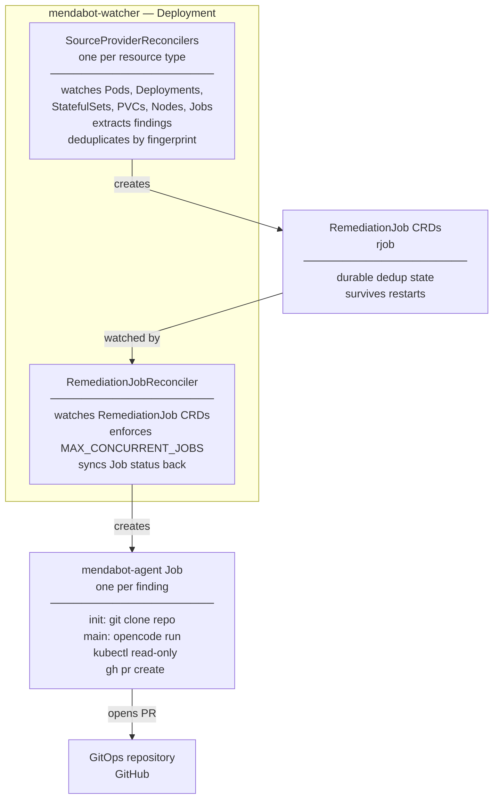
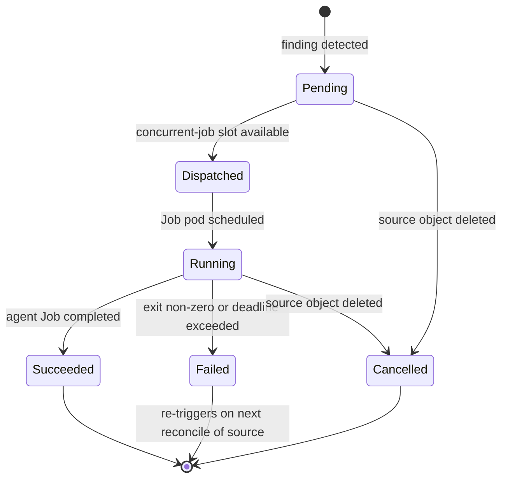

# k8s-mendabot

A Kubernetes controller that watches core cluster resources directly, deduplicates
findings by logical parent resource, and spawns an in-cluster
[OpenCode](https://opencode.ai) agent that investigates the problem and opens a pull
request on your GitOps repository with a proposed fix.

No external operators required.

## How it works



1. `mendabot-watcher` watches Pods, Deployments, StatefulSets, PVCs, Nodes, and Jobs
   natively via the Kubernetes API — no external operator required
2. A stabilisation window (default: 120s) filters transient failures before acting
3. Findings are deduplicated by parent resource fingerprint; the `RemediationJob` CRD
   is the sole state store — no external database, no in-memory maps
4. The `mendabot-agent` Job clones your GitOps repo, investigates the live cluster,
   and produces one of three outcomes (see [What the agent does](#what-the-agent-does))

## Detected failure conditions

| Resource | Detected conditions |
|---|---|
| Pod | `CrashLoopBackOff`, `ImagePullBackOff`, `OOMKilled`, `ErrImagePull`, unschedulable, non-zero exit code |
| Deployment | `spec.replicas != status.readyReplicas`, `Available=False` |
| StatefulSet | `spec.replicas != status.readyReplicas`, `Available=False` |
| PersistentVolumeClaim | `Phase == Pending` with `ProvisioningFailed` event |
| Node | `NodeReady == False/Unknown`, non-standard conditions |
| Job | Exhausted backoff limit (`failed > 0`, `active == 0`, `completionTime == nil`) |

## What the agent does

The agent runs [OpenCode](https://opencode.ai) inside the cluster with read-only RBAC.
It follows a structured investigation:

1. Check for an existing open PR for this fingerprint — if found, comment on it and exit
2. `kubectl describe` and `kubectl get events` on the failing resource
3. Inspect related resources (owning Deployment, Endpoints, PVs, etc.)
4. Locate the relevant manifests in the cloned GitOps repository
5. Inspect Flux/Helm state with `flux get all` and `helm list`
6. Determine root cause and assign a confidence level (high / medium / low)
7. Validate proposed changes with `kubeconform` and `kustomize build`
8. Open a pull request with a structured body: summary, evidence, root cause, fix, confidence

**Three possible outcomes per invocation:**

| Outcome | When | Action |
|---|---|---|
| Fix PR | Root cause identified, confidence medium or high | Opens a PR with a targeted manifest change |
| Comment | An open PR already exists for this fingerprint | Comments with updated findings; no new PR |
| Investigation PR | Root cause unclear or confidence low | Opens a PR with an investigation report only, labelled `needs-human-review` |

Hard constraints enforced in the prompt: never commit directly to `main`; never touch
Kubernetes Secrets in the GitOps repo; exactly one outcome per invocation.

## The `RemediationJob` CRD

Every unique finding is tracked by a `RemediationJob` object (`rjob`).
This is the sole deduplication state — it survives watcher restarts and requires no
external store.

```bash
kubectl get rjob -n mendabot
```

```
NAME                          PHASE       KIND         PARENT                  JOB                                   PR    AGE
mendabot-a3f9c2b14d8e         Succeeded   Pod          Deployment/my-app       mendabot-agent-a3f9c2b14d8e                 8m
mendabot-7bc1d3e90f21         Dispatched  Deployment   Deployment/api-server   mendabot-agent-7bc1d3e90f21                 2m
mendabot-f4e2a1c85b67         Failed      Node         Node/worker-03                                                      1h
```

### RemediationJob lifecycle



- **Pending** — finding detected, waiting for a concurrent-job slot
- **Dispatched** — `batch/v1 Job` created, waiting for pod scheduling
- **Running** — agent pod is executing
- **Succeeded** — agent Job completed; `status.prRef` holds the PR URL if one was opened
- **Failed** — agent Job failed (exit non-zero or deadline exceeded); re-triggers on next reconcile
- **Cancelled** — source object was deleted while the investigation was in progress

**Deduplication:** a new `RemediationJob` is only created when the fingerprint
`sha256(namespace + kind + parentObject + sorted(error texts))` is not already covered
by a non-Failed `RemediationJob`. If the error set changes materially (hash changes),
a new investigation is triggered. If the source clears while a Job is running, the
`RemediationJob` transitions to Cancelled.

## Components

| Component | Description |
|---|---|
| `mendabot-watcher` | Go controller (controller-runtime) that watches Kubernetes resources, manages `RemediationJob` CRDs, and creates agent Jobs |
| `mendabot-agent` | Docker image containing opencode + kubectl + helm + flux + gh and supporting investigation tools |

## Agent image tools

| Tool | Version | Purpose |
|---|---|---|
| `opencode` | `1.2.10` | AI agent driver |
| `kubectl` | `1.32.3` | Cluster inspection (read-only) |
| `helm` | `3.17.2` | Chart metadata, template rendering |
| `flux` | `2.5.1` | Flux status, trace, diff |
| `kustomize` | `5.6.0` | Render and validate Kustomize overlays |
| `gh` | latest stable | PR creation, listing, commenting |
| `kubeconform` | `0.7.0` | Kubernetes manifest schema validation |
| `yq` | `4.45.1` | YAML processing |
| `jq` | apt | JSON processing |
| `stern` | `1.31.0` | Multi-pod log tailing |
| `sops` | `3.9.4` | Decrypt SOPS-encrypted secrets |
| `age` | `1.3.1` | Decrypt age-encrypted files |
| `talosctl` | `1.9.4` | Talos node inspection (requires `talosconfig` mount) |

All binaries are fetched from official releases with SHA256 checksum verification.
The agent runs as non-root (`uid=1000`).

## Prerequisites

- A GitHub App installed on your GitOps repository
- An LLM API key supported by OpenCode (OpenAI-compatible endpoint)
- Kubernetes 1.28+

### GitHub App permissions

The GitHub App requires:

| Permission | Level | Purpose |
|---|---|---|
| Contents | Write | Clone repository, create branches, push changes |
| Pull requests | Write | Create and comment on pull requests |
| Issues | Write | Reference issues in PR descriptions |

The `secret-github-app` Secret must contain three keys:

```yaml
data:
  app-id: <GitHub App ID>
  installation-id: <Installation ID for your repository>
  private-key: <PEM-encoded RSA private key>
```

The private key is used only in the agent Job's init container to exchange a short-lived
installation token (1-hour TTL). It is never injected into the main agent container.

## Quick Start

### Prerequisites

- Kubernetes >= 1.28
- Helm >= 3.14
- A GitHub App installed on your GitOps repository with: Contents (write), Pull Requests (write), Issues (write)
- An OpenAI-compatible LLM API key

### 1. Create required Secrets

```sh
kubectl create namespace mendabot

kubectl create secret generic github-app \
  --namespace mendabot \
  --from-literal=app-id=<your-app-id> \
  --from-literal=installation-id=<your-installation-id> \
  --from-file=private-key=<path-to-private-key.pem>

kubectl create secret generic llm-credentials-opencode \
  --namespace mendabot \
  --from-literal=provider-config='{"model":"gpt-4o","providers":{"openai":{"apiKey":"<your-api-key>","baseURL":"https://api.openai.com/v1"}}}'
```

### 2. Install with Helm

```sh
helm install mendabot charts/mendabot/ \
  --namespace mendabot \
  --set gitops.repo=myorg/my-gitops-repo \
  --set gitops.manifestRoot=kubernetes
```

### 3. Verify

```sh
kubectl get deployment -n mendabot
kubectl get rjob -n mendabot
```

## Helm Configuration Reference

All `values.yaml` keys and their defaults:

| Key | Default | Description |
|---|---|---|
| `image.repository` | `ghcr.io/lenaxia/mendabot-watcher` | Watcher image repository |
| `image.tag` | `""` (uses `Chart.appVersion`) | Watcher image tag |
| `image.pullPolicy` | `IfNotPresent` | Image pull policy |
| `agent.image.repository` | `ghcr.io/lenaxia/mendabot-agent` | Agent image repository |
| `agent.image.tag` | `""` (uses `Chart.appVersion`) | Agent image tag |
| `gitops.repo` | **required** | GitOps repository in `org/repo` format |
| `gitops.manifestRoot` | **required** | Path within repo to manifests root |
| `watcher.stabilisationWindowSeconds` | `120` | Seconds a finding must persist before dispatching |
| `watcher.maxConcurrentJobs` | `3` | Maximum simultaneous agent Jobs |
| `watcher.remediationJobTTLSeconds` | `604800` | TTL for completed RemediationJob objects (7 days) |
| `watcher.sinkType` | `github` | Sink type for PR creation |
| `watcher.logLevel` | `info` | Log level: debug, info, warn, error |
| `selfRemediation.maxDepth` | `2` | Max self-remediation chain depth; `0` disables |
| `selfRemediation.cooldownSeconds` | `300` | Cooldown between self-remediation dispatches (seconds) |
| `selfRemediation.upstreamRepo` | `lenaxia/k8s-mendabot` | Upstream repo for bug-fix PRs |
| `selfRemediation.disableUpstreamContributions` | `false` | Prevent PRs to upstream mendabot repo |
| `selfRemediation.disableCascadeCheck` | `false` | Disable infrastructure cascade failure detection |
| `selfRemediation.cascadeNamespaceThreshold` | `50` | % of pods failing before namespace-wide suppression |
| `selfRemediation.cascadeNodeCacheTTLSeconds` | `30` | TTL (seconds) for cascade checker node state cache |
| `agentType` | `opencode` | Agent runner type (`opencode`; `claude` is a stub — not yet functional) |
| `prompt.coreOverride` | `""` | Full core prompt override (replaces built-in `files/prompts/core.txt`) |
| `prompt.agentOverride` | `""` | Full agent prompt override (replaces built-in `files/prompts/<agentType>.txt`) |
| `rbac.create` | `true` | Create RBAC resources |
| `createNamespace` | `false` | Create `Release.Namespace` if it does not exist |
| `metrics.enabled` | `false` | Expose metrics Service on port 8080 |
| `metrics.serviceMonitor.enabled` | `false` | Create Prometheus Operator ServiceMonitor |
| `metrics.serviceMonitor.interval` | `30s` | Prometheus scrape interval |
| `metrics.serviceMonitor.scrapeTimeout` | `10s` | Prometheus scrape timeout |
| `metrics.serviceMonitor.labels` | `{}` | Additional labels for the ServiceMonitor |

### Configuration Validation

The watcher validates configuration at startup with clear error messages:

**Numeric Validations:**
- `SELF_REMEDIATION_MAX_DEPTH`: Must be ≥ 0 and ≤ 10 (prevents infinite cascades)
- `SELF_REMEDIATION_COOLDOWN_SECONDS`: Must be ≥ 0 and ≤ 3600 (1 hour maximum)
- `MAX_CONCURRENT_JOBS`: Must be > 0 (positive integer)
- `REMEDIATION_JOB_TTL_SECONDS`: Must be > 0 (positive integer)
- `STABILISATION_WINDOW_SECONDS`: Must be ≥ 0

 **Format Validations:**
 - `GITOPS_REPO`: Must be in `owner/repo` format

 **Example Configurations:**

 ```bash
 # Production-safe configuration
 SELF_REMEDIATION_MAX_DEPTH=2
 SELF_REMEDIATION_COOLDOWN_SECONDS=300

 # Disable cascade prevention entirely
 SELF_REMEDIATION_MAX_DEPTH=0

 # Debug configuration (not for production)
 SELF_REMEDIATION_MAX_DEPTH=10
 SELF_REMEDIATION_COOLDOWN_SECONDS=60
 ```

See [`docs/DESIGN/lld/DEPLOY_LLD.md`](docs/DESIGN/lld/DEPLOY_LLD.md) for the full
configuration reference.

## Documentation

- [`docs/DESIGN/HLD.md`](docs/DESIGN/HLD.md) — Architecture and design decisions
- [`docs/DESIGN/lld/`](docs/DESIGN/lld/) — Component-level low-level designs
- [`docs/BACKLOG/`](docs/BACKLOG/) — Implementation backlog and feature tracker
- [`README-LLM.md`](README-LLM.md) — LLM implementation guide

## License

Apache 2.0
